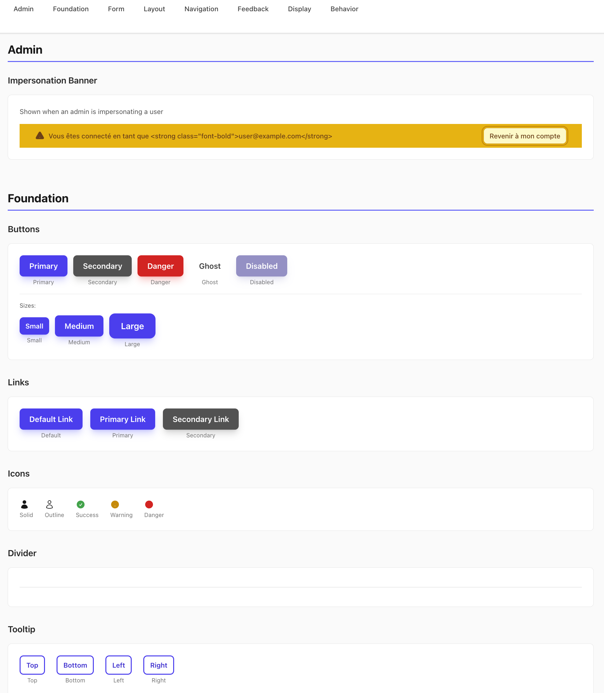

# Rails ViewComponent Library

A comprehensive, production-ready library of reusable UI components for Ruby on Rails applications. Built with [ViewComponent](https://viewcomponent.org/), [Stimulus](https://stimulus.hotwired.dev/), and [TailwindCSS](https://tailwindcss.com/).

[](https://www.ruby-lang.org/)
[](https://rubyonrails.org/)
[](https://viewcomponent.org/)
[](https://opensource.org/licenses/MIT)



## Features

- **🎨 40+ Production-Ready Components** - Buttons, forms, modals, alerts, navigat  ion, and more
- **🌍 Internationalization** - Built-in i18n support with English and French translations
- **⚡️ Interactive** - Stimulus controllers for rich client-side behavior
- **🎯 Type-Safe** - Strict validation of variants, sizes, and configuration
- **🧪 Well-Tested** - Comprehensive RSpec test coverage with Capybara
- **📱 Responsive** - Mobile-first design with TailwindCSS utilities
- **🔧 Customizable** - Easy to extend and override with HTML attributes
- **♿️ Accessibility** - WCAG 2.1 AA compliant with proper ARIA attributes

## Component Categories

### Foundation
Core primitives for building interfaces:
- **Buttons** - Multiple variants (primary, secondary, danger, outline, ghost)
- **Icons** - Heroicons integration with outline, solid, and mini variants
- **Links** - Styled links with button-like appearance options
- **Tooltips** - Accessible hover tooltips with multiple placements
- **Spinner** - Loading indicators
- **Divider** - Visual content separators

### Forms
Complete form field components with validation states:
- **Text Input** - Standard text fields with hints and errors
- **Textarea** - Multi-line text input with auto-resize option
- **Select** - Dropdown selects with custom styling
- **Checkbox** - Single checkbox with label positioning
- **Checkbox Group** - Multiple checkboxes in a fieldset
- **Radio** - Single radio button
- **Radio Group** - Radio button groups with proper accessibility
- **Switch** - Toggle switches for boolean preferences
- **Password Input** - Password field with show/hide toggle
- **Date Picker** - Calendar date selection (Stimulus-powered)
- **File Upload** - File input with drag-and-drop

All form fields include:
- Consistent label, hint, and error rendering
- Automatic ID generation and ARIA attribute management
- Size variants (small, medium, large)
- Full keyboard navigation support

### Feedback
User notification components:
- **Alerts** - Contextual alerts (info, success, warning, error) with actions and dismissible states
- **Toasts** - Auto-dismissing notification toasts
- **Confirmation Modal** - Action confirmation dialogs with type-specific styling

### Layout
Structural components for page organization:
- **Cards** - Content containers with header/footer slots
- **Modals** - Accessible modal dialogs with backdrop
- **Tabs** - Tab navigation with multiple variants (underline, pills, boxed)
- **Page Header** - Page titles with breadcrumbs and actions
- **Empty State** - Placeholder for empty content areas

### Navigation
Navigation and menu components:
- **Navbar** - Application header with branding and navigation
- **Dropdown Menu** - Context menus with keyboard navigation
- **Pagination** - Page navigation with ellipsis
- **Language Switcher** - Locale selection dropdown

### Display
Data presentation components:
- **Badge** - Status indicators and labels with color variants
- **Stat Card** - Metrics display with icons and trends
- **Timeago** - Relative time display with auto-updating

### Behavior
Interactive utility components:
- **Clipboard** - Copy-to-clipboard with visual feedback

## Installation

### In an Existing Rails App

1. Copy the component library into your Rails application:

```bash
# Copy components
cp -r app/components/* your-app/app/components/

# Copy Stimulus controllers
cp -r app/javascript/controllers/components/* your-app/app/javascript/controllers/components/

# Copy translations
cp -r config/locales/components/* your-app/config/locales/components/
```

## Component Previews

This library includes ViewComponent previews for visual development and testing. To view them:

1. Start your Rails server
2. Navigate to `/rails/view_components`
3. Browse all component variations and examples

Preview files are located in `test/components/previews/` and provide extensive examples of each component's capabilities.

## Development

### Running Tests

```bash
# Run all component specs
bundle exec rspec spec/components/

# Run a specific component test
bundle exec rspec spec/components/display/badge_component_spec.rb

# Run concern tests
bundle exec rspec spec/components/concerns/
```

### Creating a New Component

1. Generate the component files:

```ruby
# app/components/category/my_component.rb
class Category::MyComponent < ViewComponent::Base
  include HtmlAttributesRendering
  include I18nHelpers

  strip_trailing_whitespace

  VARIANTS = %i[default primary].freeze

  def initialize(text:, variant: :default, **html_attributes)
    @text = text
    @variant = variant.to_sym
    @html_attributes = html_attributes

    validate_variant!
  end

  private

  def validate_variant!
    return if VARIANTS.include?(@variant)
    raise ArgumentError, "Invalid variant: #{@variant}"
  end

  def merged_html_attributes
    { class: container_classes }.merge(@html_attributes.except(:class))
  end

  def container_classes
    ["base-classes", variant_classes, @html_attributes[:class]].compact.join(" ")
  end

  def variant_classes
    case @variant
    when :primary then "bg-blue-500"
    when :default then "bg-gray-100"
    end
  end
end
```

2. Create the template:

```erb
<%# app/components/category/my_component/my_component.html.erb %>
<div <%= tag.attributes(merged_html_attributes) %>>
  <%= @text %>
</div>
```

3. Add tests:

```ruby
# spec/components/category/my_component_spec.rb
require "rails_helper"

RSpec.describe Category::MyComponent, type: :component do
  it "renders with text" do
    render_inline(described_class.new(text: "Hello"))
    expect(page).to have_text("Hello")
  end
end
```

4. Create a preview:

```ruby
# test/components/previews/category/my_component_preview.rb
class Category::MyComponentPreview < ViewComponent::Preview
  def default
    render(Category::MyComponent.new(text: "Example"))
  end
end
```

### Architecture Patterns

This library follows consistent patterns:

- **Concerns**: `HtmlAttributesRendering` and `I18nHelpers` for all components
- **Validation**: Enum validation in `initialize` with descriptive errors
- **Configuration Hashes**: Type-specific styling via `TYPE_CONFIG` constants
- **Stimulus Integration**: Controllers namespaced as `components--{name}`
- **Accessibility**: ARIA attributes, keyboard navigation, screen reader support
- **I18n**: Component-scoped translations with fallbacks via `t_component()`

See [.github/copilot-instructions.md](.github/copilot-instructions.md) for detailed architectural documentation.

## Contributing

Contributions are welcome! Please feel free to submit a Pull Request. For major changes, please open an issue first to discuss what you would like to change.

### Guidelines

1. Follow the existing component patterns and conventions
2. Include RSpec tests for all new components
3. Add ViewComponent previews showing component variations
4. Update translations for both English and French
5. Ensure accessibility compliance (ARIA, keyboard navigation)
6. Document usage examples in component class comments

## License

This project is licensed under the MIT License - see the [LICENSE](LICENSE) file for details.

## Acknowledgments

- Built with [ViewComponent](https://viewcomponent.org/) by GitHub
- Styled with [TailwindCSS](https://tailwindcss.com/)
- Interactive behaviors powered by [Stimulus](https://stimulus.hotwired.dev/)
- Icons from [Heroicons](https://heroicons.com/)

## Support

If you find this library useful, please consider:
- ⭐ Starring the repository
- 🐛 Reporting issues
- 💡 Suggesting new components or features
- 🤝 Contributing improvements

---

Made with ❤️ for the Ruby on Rails community
